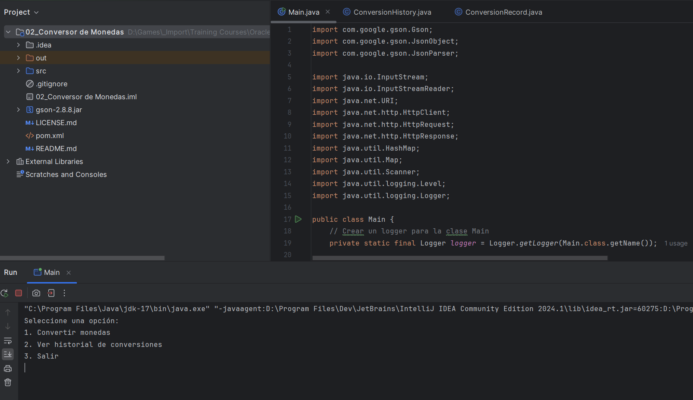

<p align="center">
  	
</p>

# Conversor de Monedas en Java - Oracle y Alura Challenge

Este es un proyecto en Java para un **Conversor de Monedas**, mi solución para el segundo desafío de programación de Oracle Next Generation (ONE) de Alura, que permite a los usuarios convertir entre diferentes monedas usando tasas de cambio actuales. El proyecto también incluye una funcionalidad para ver el historial de conversiones realizadas.

## Descripción

El programa usa la API de [ExchangeRate-API](https://www.exchangerate-api.com/) para obtener tasas de cambio en tiempo real y permite a los usuarios convertir entre varias monedas. También se utiliza la biblioteca [Gson](https://github.com/google/gson) para manejar datos JSON en el programa.

### Funcionalidades

- **Convertir monedas:** Convierte una cantidad de una moneda a otra usando tasas de cambio actuales.
<p align="center">
  	
</p>
<p align="center">
  	
</p>
<p align="center">
  	
</p>

- **Historial de conversiones:** Muestra un historial de todas las conversiones realizadas durante la sesión.
- **Manejo de errores:** Validación de entradas para asegurar que las opciones de moneda sean válidas y los montos sean números válidos.
<p align="center">
  	
</p>

## Tecnologías utilizadas

- **Lenguaje:** Java
- **API de tasas de cambio:** [ExchangeRate-API](https://www.exchangerate-api.com/)
- **Manejo de JSON:** [Gson](https://github.com/google/gson) (Versión 2.8.8)
- **HTTP Client:** Java `HttpClient`

## Estructura del proyecto

El proyecto tiene los siguientes archivos principales:

- **`Main.java`**: La clase principal del programa que maneja la conversión de monedas y la interacción con el usuario.
- **`ConversionHistory.java`**: Maneja el historial de conversiones, almacenando y mostrando registros de conversiones.
- **`ConversionRecord.java`**: Representa un registro de una conversión de moneda, incluyendo detalles como la cantidad, monedas involucradas, tasa de conversión, y timestamp.

## Instalación

Sigue estos pasos para configurar y ejecutar el proyecto en tu máquina local:

1. **Clona el repositorio**

   ```bash
   git clone https://github.com/CJ-Nieto/Challenge-2-converter-ONE
   ```

2. **Abre el proyecto en IntelliJ IDEA**

   - Abre IntelliJ IDEA.
   - Selecciona "Open" y navega al directorio donde clonaste el repositorio.
   - Abre el proyecto.

3. **Configura el archivo `pom.xml`**

   Si aún no tienes un archivo `pom.xml`, puedes crear uno en la raíz del proyecto con el siguiente contenido:

   ```xml
   <project xmlns="http://maven.apache.org/POM/4.0.0" xmlns:xsi="http://www.w3.org/2001/XMLSchema-instance" xsi:schemaLocation="http://maven.apache.org/POM/4.0.0 http://maven.apache.org/POM/4.0.0/maven-4.0.0.xsd">
       <modelVersion>4.0.0</modelVersion>
       <groupId>com.example</groupId>
       <artifactId>mi-proyecto</artifactId>
       <version>1.0-SNAPSHOT</version>
       <dependencies>
           <dependency>
               <groupId>com.google.code.gson</groupId>
               <artifactId>gson</artifactId>
               <version>2.8.8</version>
           </dependency>
		   <!-- Otras dependencias aquí -->
       </dependencies>
   </project>
   ```
   
   Asegúrate de reemplazar `com.example` y `mi-proyecto` con los valores apropiados para tu proyecto. Con esta configuración, Maven descargará automáticamente la biblioteca Gson y la incluirá en tu proyecto.

4. **Agrega tu API Key**

   Asegúrate de reemplazar `"TU_API_KEY"` en el archivo `Main.java` con tu clave de API de [ExchangeRate-API](https://www.exchangerate-api.com/).

   ```java
   String apiKey = "TU_API_KEY";
   String url = "https://v6.exchangerate-api.com/v6/" + apiKey + "/latest/USD";
   ```

5. **Construye el proyecto**

   - En IntelliJ IDEA, ve a `Build` > `Build Project` para descargar las dependencias y compilar el proyecto.

## Uso

Para ejecutar el programa:

1. **Inicia la aplicación**

   Ejecuta la clase `Main` desde tu IDE o desde la línea de comandos:

   ```bash
   mvn exec:java -Dexec.mainClass="Main"
   ```

2. **Selecciona una opción del menú**

   El programa mostrará un menú con las siguientes opciones:
   - **1. Convertir monedas**
   - **2. Ver historial de conversiones**
   - **3. Salir**
  
   <p align="center">
  	
   </p>

   Sigue las instrucciones en pantalla para ingresar la cantidad, seleccionar las monedas de origen y destino, o para ver el historial de conversiones.

## Ejemplo de ejecución

```
Seleccione una opción:
1. Convertir monedas
2. Ver historial de conversiones
3. Salir
1
Ingrese la cantidad:
100
Seleccione la moneda de origen:
USD EUR JPY GBP ...
USD
Seleccione la moneda de destino:
USD EUR JPY GBP ...
EUR
100 USD a EUR: 94.21
```

>[!IMPORTANT]
>## Cómo añadir el archivo `currencyNames.json`

Asegúrate de que el archivo `currencyNames.json` esté ubicado en la carpeta `src` de tu proyecto para que sea accesible desde `Main.class.getResourceAsStream("/currencyNames.json")`. Si estás usando un IDE como IntelliJ IDEA o Eclipse, coloca el archivo en el directorio `src/main/resources` (para Maven) o `src/resources` (para un proyecto estándar) y si es necesario especifica la ruta en el código.

>[!NOTE]
>## Alternativas al `Logger`

Si prefieres un sistema de logging más avanzado, considera usar uno de estos frameworks:

- [SLF4J](https://www.slf4j.org/): Interfaz de logging común para diferentes implementaciones de logging.
- [Log4j](https://logging.apache.org/log4j/2.x/): Biblioteca de logging avanzada para aplicaciones Java.
- [Logback](https://logback.qos.ch/): Implementación de SLF4J más moderna y rica en características.

>[!NOTE]
>## Ejemplo con SLF4J y Logback

Si decides usar SLF4J con Logback, añade las siguientes dependencias a tu archivo `pom.xml` (para Maven):
```bash
	   <dependency>
		<groupId>org.slf4j</groupId>
		<artifactId>slf4j-api</artifactId>
		<version>2.0.0</version> <!-- Usar la última versión estable -->
	</dependency>
	<dependency>
		<groupId>ch.qos.logback</groupId>
		<artifactId>logback-classic</artifactId>
		<version>1.4.5</version> <!-- Usar la última versión estable -->
	</dependency>
   ```

Y actualiza el código para usar el `Logger` de SLF4J en lugar de `java.util.logging.Logger`.
```bash
		import org.slf4j.Logger;
	import org.slf4j.LoggerFactory;

	public class Main {
		private static final Logger logger = LoggerFactory.getLogger(Main.class);
		...
	}
   ```

## Contribuciones

Las contribuciones al proyecto son bienvenidas. Si deseas contribuir, sigue estos pasos:

1. **Fork el repositorio**
2. **Crea una "Nueva Rama" para tu "Funcionalidad" o "Corrección de Errores"**
   ```bash
   git checkout -b mi-nueva-funcionalidad
   ```
3. **Realiza tus cambios y realiza commits**
   ```bash
   git commit -am 'Agrega nueva funcionalidad'
   ```
4. **Push a tu rama y crea un "Pull Request"**

## Licencia

Este proyecto está licenciado bajo la Licencia MIT - ver el archivo [LICENSE](LICENSE.md) para más detalles.
